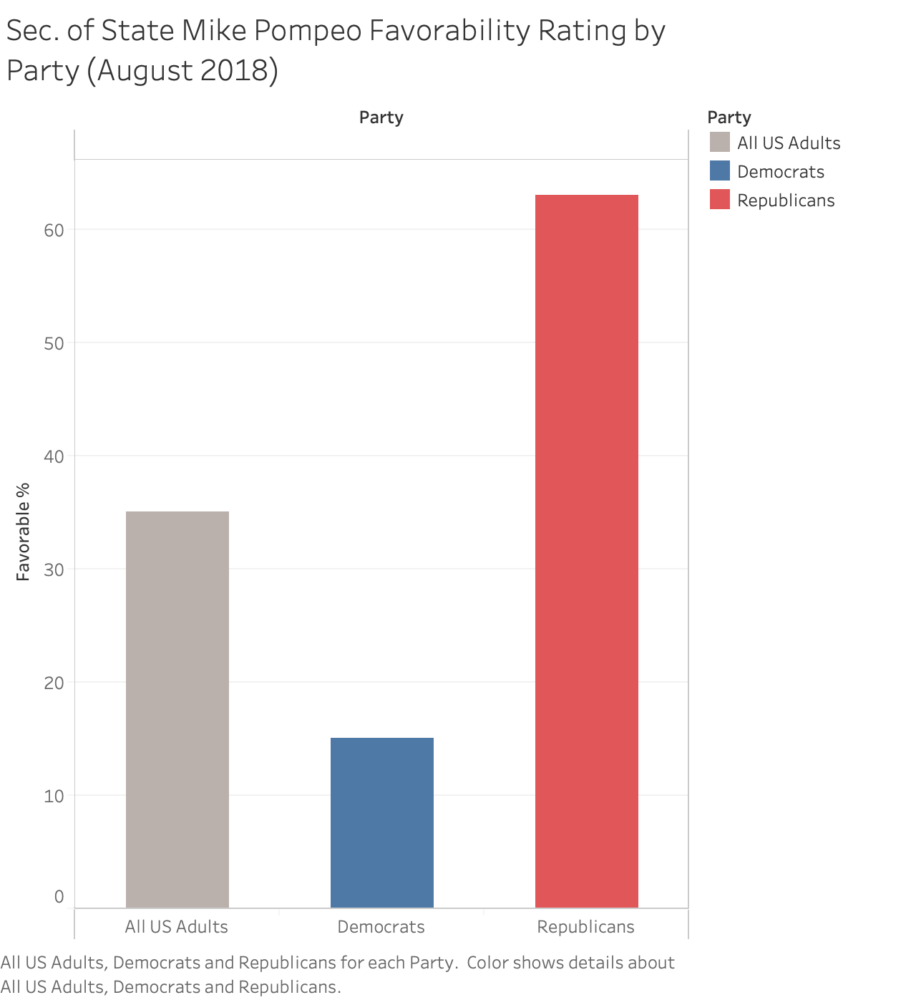

```{r setup, include=FALSE}
knitr::opts_chunk$set(echo = FALSE)
```
<style>
body {
text-align: justify}
</style>


Global phenomena are often most readily discussed in global terms. In the case of the COVID-19 pandemic, different political and cultural sub-divisions generally agree on unambiguous concepts that lend themselves to quantification. For example, the number of hospital beds available in a given city as compared to another city, or the rate at which patients with a certain set of symptoms are admitted to hospitals. Whether a hospital is located in New York City, Tokyo, or Berlin, medical professionals at these hospitals are equipped with the expertise and a common set of terms and skills to delineate between pneumonia-like symptoms and chickenpox-like symptoms. 

Despite these ‘big-picture’ commonalities, global phenomena have intensely local impacts and implications that can be more challenging to discuss. Just as countless factors influence an individual community’s fitness to respond to challenges in public health, different nations and sub-national groups have different capabilities for credibly communicating those challenges to their respective publics. The arrival of COVID-19 has presented every level of every government on the planet with a common set of new problems which are placed atop previously existent tension and crises. Two such antecedent tensions in the United States are the growing public mistrust of institutions that are traditionally responsible for fact-reporting (government, journalism, and academia), as well as a trend toward partisan polarization of both the general public and notable spokespersons for the aforementioned institutions. One way that these tensions have manifested themselves is through the narrative political-charging of COVID-19-related public health information. 	

This article seeks to explore the topic of COVID-19 misinformation in the U.S. through a credible, well-sourced account of where known facts align with as well as diverge from both popular and fringe narratives. It will also offer some discussion of the role played by authority figures, partisanship, and motivated cognition in the proliferation of COVID-19 misinformation. In doing so, we begin with a brief timeline of what is known and we attempt to capture key moments in the brief but rapid evolution of early COVID-19 misinformation in the U.S. This timeline will chronicle the earliest credible information available, from COVID-19’s origin in late 2019 until the end of April 2020. During this time, U.S. Federal policy appeared to be informed by a piece of COVID-19 misinformation and U.S. cases and deaths approached their first major “spike.” This account is by no means exhaustive, and seeks to examine only a small part of a global and volatile series of events.

**November 17, 2019:** A 55 year old male resident of Hubei Province in China is the first known individual confirmed to suffer from a pneumonia-like respiratory disease that in a few short weeks would be identified as a novel human coronavirus – a family of viruses first identified in various species of animals in the 1930s, and first observed in humans in the 1960s.^[Ma, Josephine. March 13th, 2020. South China Morning Post. https://www.scmp.com/news/china/society/article/3074991/coronavirus-chinas-first-confirmed-covid-19-case-traced-back?exp_signup=opt-ggl-sign-in&onboard=true] ^[Estola, Timo. May 2nd, 1970. Avian Diseases. https://www.jstor.org/stable/1588476?origin=crossref&seq=1#metadata_info_tab_contents] ^[Kahn, Jeffrey and McIntosh, Kenneth. November 1st, 2005. The Pediatric Infectious Disease Journal. https://journals.lww.com/pidj/fulltext/2005/11001/history_and_recent_advances_in_coronavirus.12.aspx]

**November 17 – December 8, 2019:** Doctors at Jinyintan Hospital located in Wuhan, Hubei Province documented 41 cases of an infectious respiratory illness, among which common symptoms now associated with COVID-19 began to present on or around December 1, 2019. Their study interviewed patients regarding their recent contacts as well as travels, and found that at least 27 of the first 41 cases had been exposed to the Huanan Seafood Wholesale Market. However, at the time of this article’s publishing, the ongoing search for a true “patient zero” means that the first case of COVID-19 has not been definitively identified.^[Huang, Chaolin, et al. January 24th, 2020. The Lancet. https://www.thelancet.com/journals/lancet/article/PIIS0140-6736(20)30183-5/fulltext]

**December 24 – 27, 2019:** Multiple hospitals throughout Wuhan reported cases of pneumonia-like illnesses without clear causes, but presented strong evidence of human-to-human communicability, which prompted several of these hospitals to submit patient samples of pneumonic fluid to laboratories for further analysis. By this time, it is estimated that approximately 180 cases of COVID-19 had spread throughout Wuhan, though the exact number is impossible to know due to the reality that initial cases of novel diseases tend to precede the ability to test for and track them.^[Wu, Zunyou and McGoogan, Jennifer. February 24th, 2020. JAMA Network. https://jamanetwork.com/journals/jama/fullarticle/2762130]

**December 29 – 30, 2019:** Of the multiple labs contracted to conduct further analysis on COVID-19 patient samples, BGI Genomics in China was the first to arrive at the independent conclusion that the pneumonia-like respiratory illness was, in fact, a novel coronavirus. Upon learning of these findings, the Wuhan Municipal Center for Disease Control and Prevention (CDC) organized an investigative team. They issued an urgent notice to medical institutions about the emergence of an infectious pneumonia-like disease linked to the Huanan Seafood Wholesale Market, and ordered them to compile statistics on related cases.^[Yu, Gao, et al. February 29th, 2020. Caixin Global. https://www.caixinglobal.com/2020-02-29/in-depth-how-early-signs-of-a-sars-like-virus-were-spotted-spread-and-throttled-101521745.html]

**January 24 – 30. 2019:** As unconfirmed cases occurred in Texas, California, and Arizona, local news outlets in the U.S. first began covering COVID-19.^[Taylor, Brittany and Smith, Tierra. January 23rd, 2020. Click2Houston. https://www.click2houston.com/news/local/2020/01/23/brazos-county-investigating-suspected-case-of-novel-coronavirus/] ^[Ahmed, Shahan. January 25th, 2020. NBC Los Angeles. https://www.nbclosangeles.com/news/orange-countys-first-novel-coronavirus-case-confirmed/2298278/] ^[Kim, Allen. January 29th, 2020. CNN. https://www.cnn.com/2020/01/29/health/asu-coronavirus-petition-trnd/index.html] A student-led petition at Arizona State University to cancel in-person classes marked one of the first instances of national news coverage of COVID-19.^[Change.org. No date. https://www.change.org/p/asu-students-asu-coronavirus]

**January 26, 2020:** The Washington Times, a solidly conservative-right-leaning Washington DC-based news outlet with a daily circulation of approximately 52,000 readers and over 10,000,000 monthly views, published a sensational article. It speculated that “[t]he deadly animal-borne coronavirus spreading globally may have originated in a laboratory in the city of Wuhan linked to China’s covert biological weapons program. . .”. This sparked widespread recirculation and further unsourced, unfounded speculation by prominent Republican Senator Tom Cotton about COVID-19’s potentially nefarious man-made origins.^[Ad Fontes Media. No date. https://www.adfontesmedia.com/washington-times-bias-and-reliability/] ^[Gertz, Bill. January 26th, 2020. The Washington Times. https://www.washingtontimes.com/news/2020/jan/26/coronavirus-link-to-china-biowarfare-program-possi/] ^[Brewster, Jack. May 10th, 2020. Forbes Magazine. https://www.forbes.com/sites/jackbrewster/2020/05/10/a-timeline-of-the-covid-19-wuhan-lab-origin-theory/#3e7308ab5aba] On the same date, the World Health Organization (WHO) published their 6th situation report. It detailed that 2,014 active cases of COVID-19 were confirmed worldwide, with the vast majority located in China (Figure 1).^[World Health Organization. January 26th, 2020. https://www.who.int/docs/default-source/coronaviruse/situation-reports/20200126-sitrep-6-2019--ncov.pdf?sfvrsn=beaeee0c_4]


**Figure 1** (Credit: WHO)

**February 19, 2020:** In response to the explosion of conspiracy theories propagated on both traditional and non-traditional media platforms by journalists, celebrities, members of the public, and politicians, a group of 27 prominent scientists from around the world issued a statement condemning and debunking misinformation regarding the origins of COVID-19.^[McCann Ramirez, Mikki. February 27th, 2020. USA Today. https://www.usatoday.com/story/opinion/2020/02/27/fox-news-right-wing-media-conspiracy-theories-coronavirus-covid-19-column/4886082002/] ^[Calisher, Charles, et al. February 19th, 2020. The Lancet. https://www.thelancet.com/journals/lancet/article/PIIS0140-6736(20)30418-9/fulltext]

**March 25 – 27, 2020:** The Washington Times issued an editor’s note on the original article that spawned the Wuhan lab conspiracy theory. It tepidly offered that “the exact origins remain murky.” As this occurred, the WHO published their 67th Situation Report detailing 509,164 global cases of COVID-19, with the three largest shares belonging to China with 82,078 cases, Italy with 80,539 and the U.S. quickly catching up with 68,334 (Figure 2).^[World Health Organization. March 27th, 2020. https://www.who.int/docs/default-source/coronaviruse/situation-reports/20200327-sitrep-67-covid-19.pdf?sfvrsn=b65f68eb_4] 


**Figure 2** (WHO: Credit)

**April 11, 2020:** The Daily Mail, a conservative right-leaning, U.K.-based tabloid which attracts up to 100 million views per month, published a sensational story claiming that scientists at the U.S.-funded Wuhan Institute of Virology may be to blame for the coronavirus outbreak.^[Media Bias/Fact Check. No date. https://mediabiasfactcheck.com/daily-mail/] ^[The Economist. January 5th, 2013. https://www.economist.com/business/2013/01/05/correction-daily-mail-website] ^[Owen, Glen. April 11th, 2020. Daily Mail. https://www.dailymail.co.uk/news/article-8211257/Wuhan-lab-performing-experiments-bats-coronavirus-caves.html]

**April 24, 2020:** The Trump administration terminated an ongoing research grant to the National Institutes of Health (NIH). This occurs in response to Republican Congressman Matt Gaetz’s April 13 allegation that the COVID-19 pandemic is somehow linked to the Wuhan Institute of Virology. This termination abruptly ended a 15 year effort to catalogue and combat zoonotic diseases.^[Creitz, Charles. April 14th, 2020. Fox News. https://www.foxnews.com/media/gaetz-end-nih-grant-wuhan-virology-lab] ^[Owermohle, Sarah. April 27th, 2020. Politico. https://www.politico.com/news/2020/04/27/trump-cuts-research-bat-human-virus-china-213076] ^[Pelley, Scott. May 11th, 2020. CBS News. https://www.cbsnews.com/news/trump-administration-coronavirus-vaccine-researcher-covid-19-cure-60-minutes/]

**April 30, 2020:** The WHO published their 101st COVID-19 Situation Report, which detailed that global cases have grown sixfold in only a month to 3,090,445 with a total of 217,769 deaths. A third of these new cases are confirmed in the U.S. where cases have exploded to 1,003,974 cases, roughly 14 times the numbers present only a month prior. It further elaborated that the U.S. death toll has struck 52,428, which is more than Italy, Brazil, and China combined (Figure 3).^[World Health Organization. April 30th, 2020. https://www.who.int/docs/default-source/coronaviruse/situation-reports/20200430-sitrep-101-covid-19.pdf]


**Figure 3** (Credit: WHO)

In parallel with the escalation of the crisis during the spring season, as shown in the preceding timeline, belief in unproven COVID-19 origin theories skyrocketed among Americans. Public polling from the Pew Research Center suggests that profound uncertainty existed regarding the COVID-19’s origin due to the multiple conflicting narratives peddled online (Figure 4).^[Schaeffer, Katherine. April 8th, 2020. Pew Research Center. https://www.pewresearch.org/fact-tank/2020/04/08/nearly-three-in-ten-americans-believe-covid-19-was-made-in-a-lab/]


**Figure 4** (Credit: Shiva Teerdhala)

According to a survey conducted between March 10 and 16, during the early days of the crisis, 29% of Americans said that COVID-19 was created in a Chinese lab. Another 25% of all American adults responded that they were “unsure” of its place of origin. Combined, these two numbers are chilling – most Americans did not believe the scientific consensus that COVID-19 transmission began in Chinese wet markets. Many competing explanations could explain this phenomenon. These include ignorance, willful denial, or more likely, a pattern of culturally motivated cognition where individuals perceive misinformation to be correct if it confirms prior beliefs or attitudes that conform to their in-group identity (the latter concept is the focus of this paper). Although there are many factors that lead Americans to believe conspiracy theories, the highly partisan environment of contemporary American politics lends itself to examining conspiracy theory belief through a partisan lens. However, before entering this discussion, it is important to note that the American public is not split evenly into Democrats and Republicans. 40% of the population does not identify with either party – in fact, membership in the Democratic and Republican parties has hovered at only 20 – 30% each since 2004.^[Gallup. No date. https://news.gallup.com/poll/15370/party-affiliation.aspx]

Nonetheless, for the purpose of our discussion, the disparity between belief in conspiracy theories for Democrats and Republicans is stronger than that for Independents, who largely align with the center of the electorate and thus the American public as a whole. Strikingly, while 37% of Republicans subscribe to the made-in-a-lab conspiracy theory, only 21% of Democrats believe the same. The imbalance towards Republicans in survey respondents who believe in the conspiracy theory points toward the politicization of COVID-19 in the U.S. – Republicans are more likely to subscribe to COVID-19 conspiracy theories in part due to explicit support from prominent leaders. In contrast, Democrats’ relatively lower belief in the made-in-a-lab theory can be attributed to their opposition to the Republican Party and its leaders. In short, group identification and politicization has directly affected the spread of conspiracy theories in the U.S.

The direct impact of political polarization on the overt messaging of political figures is evident in recent political events. On May 3, President Trump and Secretary of State Pompeo both referenced the increasingly popular made-in-a-lab conspiracy theory by stating that they had received “evidence that [COVID-19] came from that laboratory in Wuhan".^[Borger, Julian. May 3rd, 2020. The Guardian. https://www.theguardian.com/world/2020/may/03/mike-pompeo-donald-trump-coronavirus-chinese-laboratory] This aggressive statement appeared to be a political response to unsubstantiated conspiracy theories from Chinese officials who blamed COVID-19 on the U.S. military (China’s state-controlled media is widely recognized as a Communist Party propaganda outlet that regularly disseminates fake news).^[Boxwell, Robert. April 4th, 2020. Politico. https://www.politico.com/news/magazine/2020/04/04/china-fake-news-coronavirus-164652] Indeed, the administration’s promotion of the made-in-a-lab theory seemed to be a direct response to Chinese misinformation, as well as an attempt to influence the negative American media narrative during an election year.  Despite the political motivations of the executive branch’s statements, such absolute and far-reaching statements can have massive implications during crises, when citizens are more likely to look to the government for guidance and assistance. Cues from partisan leaders are essential to shaping the views of party faithful. This may explain why a larger proportion of Republicans than Democrats express belief in the made-in-a-lab theory. Hearing explicit support from respected political figures provided a hitherto discreditable theory with validation from trusted leaders. The effect is even more pronounced when one considers the popular support that President Trump and Secretary Pompeo command among Republicans (Figures 5 and 6).^[Gallup. No date. https://news.gallup.com/poll/203198/presidential-approval-ratings-donald-trump.aspx] ^[Reinhart, RJ. August 30th, 2018. Gallup. https://news.gallup.com/poll/241844/snapshot-pompeo-draws-mixed-opinions-americans.aspx]


**Figure 5** (Credit: Shiva Teerdhala)


**Figure 6** (Credit: Shiva Teerdhala)

The polling organization, Gallup, regularly conducts surveys to gauge approval ratings of prominent politicians. The firm’s latest approval rating poll for President Trump was conducted from June 8 – 30, 2020 and reveals a striking partisan divide. Although 38% of the general American public approved of the president’s performance, nearly 91% of Republicans approved while only 2% of Democrats did the same. For context, Trump’s approval ratings for both groups have remained relatively constant throughout his term, near 85% or higher among Republicans and 15% or less for Democrats. A similar trend can be observed in the last approval poll conducted for Pompeo, albeit on a less extreme scale (due to his less prominent profile). His favorable ratings among all Americans were roughly similar to Trump’s (35%); however, as expected, 63% of Republicans expressed approval compared to only 15% of Democrats. Evidently, while Democratic-leaning voters do not seem to hold either of these officials in high esteem, Republicans do. The overwhelming majority of Republicans express approval of President Trump; it stands to reason that these individuals trust him and his administration, as opposed to an ambiguous scientific community whose motivations and beliefs are unclear. Similarly, it is not entirely unimaginable that if an identical situation occurred with a Democratic administration, the opposite trend, with left-leaning individuals expressing greater belief in conspiracy theories, would be observed.^[Nyhan, Brendan. February 15th, 2017. The New York Times. https://www.nytimes.com/2017/02/15/upshot/why-more-democrats-are-now-embracing-conspiracy-theories.html]

These data demonstrate that Republicans currently express more belief in COVID-19 conspiracy theories than their counterparts on the left. Unfortunately, an extremely toxic narrative has taken hold in the national media that attributes belief in conspiracy theories to a lack of education among conservatives. Of course, there is considerable evidence to the contrary – many conservative elites who have expressed support for such beliefs are highly educated. For example, Trump and Pompeo are graduates of the University of Pennsylvania and Harvard Law School, respectively.^[Wikipedia. No date. https://en.wikipedia.org/wiki/Donald_Trump] ^[Wikipedia. No date. https://en.wikipedia.org/wiki/Mike_Pompeo]  Likewise, Senator Cotton of Arkansas, another proponent of the made-in-a-lab conspiracy theory, attended Harvard for both undergraduate studies and law school.^[Wikipedia. No date. https://en.wikipedia.org/wiki/Tom_Cotton] Thus, a lack of education and analytical skills cannot be the sole explanation for belief in conspiracy theories, despite the popular media narrative attributing these views to ignorance or paranoia. Instead, there must be another factor causing increased belief in COVID-19 conspiracy theories among Republicans. This hypothesis is supported by multiple studies over the past three decades. For example, a 1986 study conducted by Dr. Richard Petty of the University of Missouri demonstrated that high scores on analytical and intellectual tests did not correlate to increased skepticism of untrue (but persuasive) claims.^[Petty, Richard and Cacioppo, John. 1986. Advances in Experimental Social Psychology. https://www.sciencedirect.com/science/article/pii/S0065260108602142] Interestingly, Petty found evidence to the contrary – more scientifically literate and analytically gifted individuals have an enhanced ability to rationalize and defend conspiracy theories. This conclusion is completely at odds with the current narrative, which states that conspiracy theory believers are uneducated and require guidance. Rather, the opposite seems to be true. Intellectually gifted individuals are not immune to the effect of conspiracy theories and, in fact, possess unique capabilities to persuade themselves (and others) against the scientific consensus.

So, if deficiency in scientific knowledge is not the cause of widespread belief in conspiracy theories, then what is? All conventional explanations currently fail to explain why otherwise educated individuals might express support for conspiracy theories. However, an interesting framework developed by Yale professor Dan Kahan and his colleagues might hold the answer.^[Kahan, Daniel, et al. 2017. Psychology. https://www.semanticscholar.org/paper/Motivated-Numeracy-and-Enlightened-Self-Government-Kahan-Peters/c31861537baeba1d6ea94fd67691b8e3d05a7c0f] The “Identity-protective Cognition Thesis” postulates that cultural or political conflicts inadvertently disable the analytical abilities that individuals use to evaluate scientific conclusions in normal situations. Multiple experiments conducted by the researchers revealed that, when presented with non-controversial scientific claims such as the efficacy of antibiotics, highly educated and uneducated individuals alike conform to the consensus promoted by the scientific community. However, highly politicized topics, such as climate change, attract resistance from individuals of all education levels. Opinions on climate change diverge by party affiliation, despite the fact that educated voters should theoretically be able to empirically evaluate the conclusive scientific evidence supporting the issue. This second scenario has already manifested itself in American society with respect to COVID-19 – guidelines such as masks have become political flashpoints, while conspiracy theories are merely another front of the endless, multifaceted culture war in the U.S. Educated conservatives support resistance to COVID-19 regulations because doing so has become identified with the Republican Party through politicization of the crisis. Likewise, the opposite perspective – strict promotion of lockdowns and mask-wearing – has become a hallmark of Democrats due to their vehement opposition to President Trump. Evidently, the political nature of COVID-19 in the U.S. makes it difficult for individuals to reach across the aisle and create an effective consensus. The same politicization is now contributing to the spread of conspiracy theories. As previously discussed, many well-respected Republican politicians have expressed support for COVID-19 conspiracy theories, legitimizing it as an acceptable belief for their supporters. Thus, when educated conservatives encounter theories with dubious scientific backing, they are more likely to disregard their analytical skills to provide the “right answer” accepted by their group (Republicans, in this case). From an individual perspective, while endorsing a COVID-19 conspiracy theory may not have an immense impact on world affairs, contradicting the president’s views may have devastating results within one’s social circle. Thus, educated individuals might be motivated to rationalize COVID-19 conspiracies to maintain their identity and social standing within their current or desired in-groups. Of course, this can lead to a vicious cycle of conspiracy theory spreading, where the educated rationalize and legitimize conspiracy theories due to fear of ostracization, which causes the more malleable individuals to accept and continue spreading these theories. 

A sobering parallel that points toward the future of COVID-19 politicization is the debate over climate change, which first came onto the political radar in the 1970s. The General Social Survey (GSS) has tracked public opinion on whether the government does “too little” to protect the environment for every year since 1973. This data was cross-tabulated by party identification to reveal how climate change became an increasingly politicized issue during the ensuing fifty years (Figure 7).^[NORC at the University of Chicago. Data Explorer. 2018. https://gssdataexplorer.norc.org/projects/82921/crosstabs/141633?token=oxSZSqHARuKER45rs4s5] 


**Figure 7** (Credit: Shiva Teerdhala)

In 1970, shortly before GSS began collecting this data, Republican President Richard Nixon established the Environmental Protection Agency (EPA). This is almost impossible to believe today, as Republican politicians regularly decry the EPA, and defunding the agency is a central aspect of their national campaign platform.^[Leber, Rebecca. November 11th, 2014. The New Republic. https://newrepublic.com/article/120228/what-expect-gop-war-epa] However, between 1973 and 1991, voters of both parties tracked relatively closely on the subject. The largest gap in opinion during this period of relative unity occurred in 1984, when 72% of Democrats and 49% of Republicans responded that the government’s efforts were not sufficient to protect the environment. In contrast, the smallest gap occurred in 1990, when 78% of Democrats and 74% of Republicans gave the same response. However, since the election of President Bill Clinton in 1992, opinions have displayed a sharp and continuous divergence between partisans, resulting in the 2018 split of 34 percentage points (82% of Democrats and 48% of Republicans).

There are many explanations for the polarization that occurred in the 1990s, the most relevant centering around the concept of party sorting. For most of the 20th century, the Democratic and Republican electoral coalitions could not accurately be described as “liberals” and “conservatives” as they are today. Rather, each party had liberal and conservative wings that often overlapped.^[Lang, Corey and Pearson-Merkowitz, Shanna. November 10th, 2015. London School of Economics. https://blogs.lse.ac.uk/usappblog/2015/11/10/partisan-sorting-is-a-very-recent-phenomenon-and-has-been-driven-by-the-southern-realignment/] For example, the Congressional Democratic leadership was largely dominated by socially conservative Southerners who today would be more comfortable as Republicans than modern Democrats. In fact, Democrats maintained unified control of local and state governments in the South until the 1990s. However, a combination of demographic and cultural trends led the parties to increasingly sort themselves around ideological rather than geographic lines. Conservative Democrats, such as Senator Strom Thurmond of South Carolina, moved into the Republican fold, while the Republicans lost their liberal, Northeastern “Rockefeller Republican” faction. The year 1994, when the Republicans retook the House of Representatives for the first time in 40 years, marked the beginning of a new, polarized period in U.S. politics where the parties were significantly more liberal and conservative respectively than before.^[Wang, Sam. October 7th, 2016. The American Prospect. https://prospect.org/power/hardened-divide-american-politics/] This trend has been further accentuated in recent years, when in 2010, the rise of the Tea Party pushed Republicans further right, while the Democrats similarly moved left during the 2018 midterm elections.^[Bowden, John. March 15th, 2019. The Hill. https://thehill.com/homenews/house/434269-boehner-says-its-democrats-turn-for-a-tea-party-movement] This polarization has clearly had a trickle-down effect on voters. As party leaders have become more ideologically distinct and hostile to one another, rank-and-file partisans increasingly disagree even on issues with a clear scientific consensus. Indeed, similar to the COVID-19 situation, although Americans initially believed in the significance and scientific validity of climate change when the crisis first became salient, political polarization created the contemporary environment of distrust and gridlock. Even more significantly, the polarization of elites has influenced voters to doubt the scientific community’s recommendations and research based on their partisan identities, which was not the case in the 1970s.

The implication is clear for COVID-19. Since the start of the crisis, researchers have increasingly observed a divergence in partisan opinion regarding the virus. Many more Republicans than Democrats have expressed skepticism regarding social distancing guidelines, along with an arguably more dangerous inclination to believe in conspiracy theories and misinformation on the now politically-charged pandemic. However, the fault does not lie with voters of any one political party. Rather, this pandemic of mistrust and misinformation has spread due to a polarized political climate that encourages individuals to disregard expert recommendations in favor of theories that mesh with previously held beliefs and group identity. The development of politicization around climate change over the last 50 years offers a cautionary tale to public health experts and policy makers attempting to combat COVID-19 misinformation. In the absence of coordinated, nonpartisan efforts to simultaneously fight the pandemic and conspiracy theories, the U.S. might once again face a conflict that Americans cannot unite around, despite what the science says. 