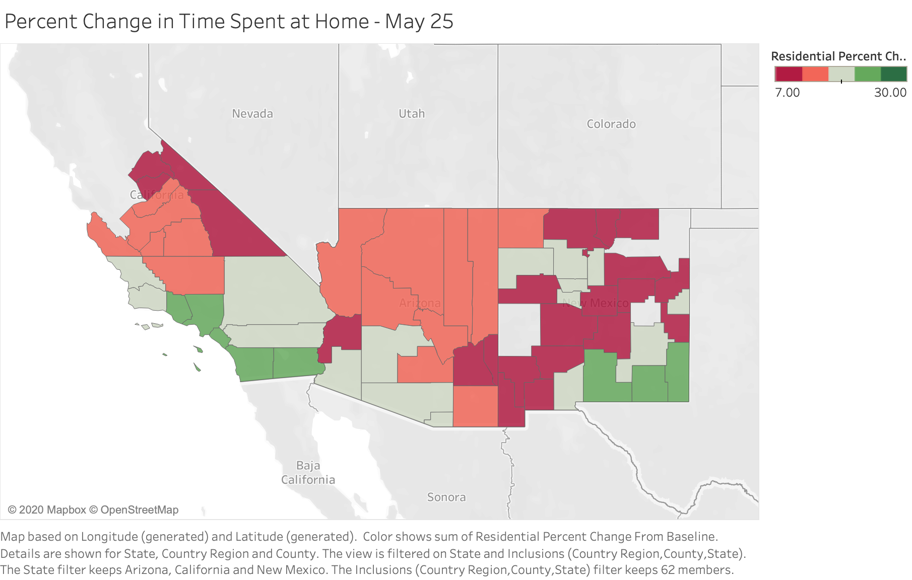

```{r setup, include=FALSE}
knitr::opts_chunk$set(echo = FALSE)
```
<style>
body {
text-align: justify}
</style>

In the United States, COVID-19 first spread in urban areas such as the Northeastern Boston-Washington corridor and California. During the initial phase of the pandemic, the U.S. recorded a peak of 36,738 new cases on April 24th.^[The New York Times. July 9th, 2020. https://www.nytimes.com/interactive/2020/us/coronavirus-us-cases.html] Thankfully, strict lockdowns managed to control those outbreaks by early June. However, the lack of a national policy response combined with rapid reopening in the Sun Belt (the region extending from Florida and Georgia to Southern California), presented favorable circumstances for a second, larger coronavirus surge, unlike in many other nations.^[Frey, William H. July 2nd, 2020. Brookings Institute. https://www.brookings.edu/blog/the-avenue/2020/06/19/covid-19s-sun-belt-surge-has-recast-the-pandemics-impact/] Indeed, the performance against coronavirus in the United States contrasts with developed countries in the EU, which successfully controlled COVID-19 following peaks in mid-March.^[Diamond, Dan. Wheaton, Sarah. June 22nd, 2020. Politico. https://www.politico.com/news/2020/06/22/united-states-italy-traded-places-coronavirus-333122] Since June 27th, when cases increased by 45,255 in a single day, the U.S. has seen consecutive days of record-breaking, non-peak increases, with 250,000 new cases in the first five days of July alone.^[Higgins-Dunn, Noah. June 27th, 2020. CNBC. https://www.cnbc.com/2020/06/27/us-coronavirus-cases-surge-by-more-than-45000-as-states-roll-back-reopenings.html] Florida, Texas, and Arizona, the largest and most populated Sun Belt states, account for the majority of this surge.^[Murphy, Joe. Siemaszko, Corky. July 6th, 2020. NBC News. https://www.nbcnews.com/news/us-news/grim-july-u-s-sees-250-00-new-coronavirus-cases-n1232979] In terms of policies, these states reopened much more rapidly and aggressively than the Northeast because they initially faced few cases of COVID-19 while other areas suffered. However, reopening policies are not the only factors causing the current COVID-19 surge. 

Continuous aversion to COVID-19 guidelines, like social distancing and mask recommendations, especially in the South, has had a chillingly consequential impact on the pandemic. The Google COVID-19 Community Mobility Report is an expansive dataset charting the physical movement of individuals during the pandemic, as compared to pre-pandemic levels.^[Google LLC "Google COVID-19 Community Mobility Reports." Accessed July 8th, 2020. https://www.google.com/covid19/mobility] These visualizations from Memorial Day 2020 demonstrate that large regions of the Sun Belt (red and gray-shaded counties) exhibited relatively small percent change in time spent at home versus pre-pandemic (Figures 1 and 2). 


Figure 1


Figure 2

Although the residents of major Texas metropolitan areas (Dallas-Fort Worth, Austin, and Houston), and San Diego, California spent significantly more time at home compared to the baseline (green-colored areas), no cities in Arizona did so. The same is true for Little Rock, Arkansas and Birmingham, Alabama. Indeed, most areas in the South other than Miami-Dade, Palm Beach, and Broward counties in Florida (Miami) and Fulton County, Georgia (Atlanta) exhibit this same trend relative to the rest of the country. This noncompliance with public health guidelines assuredly caused rising case counts in the Sun Belt during June - anecdotal evidence supports this as well, with multiple social media posts depicting gatherings at beaches, clubs, and restaurants during the Memorial Day holiday. In most of these cases, mass gatherings took place without adherence to mask guidelines and thus can directly be linked to the spread of COVID-19. Conversely, mass assemblies with high rates of mask compliance, such as the George Floyd protests, have not significantly contributed to a second wave.^[Goldstein, Joseph. July 1st, 2020. The New York Times. https://www.nytimes.com/2020/07/01/nyregion/nyc-coronavirus-protests.html]

In tandem with a lack of adherence to social distancing guidelines, masks have quickly become yet another cultural flashpoint in a divided America. The Sun Belt, in particular, demonstrated significant resistance to face coverings before the second surge, with many expressing doubts about their efficacy. Indeed, despite clear recommendations from government officials such as Dr. Anthony Fauci and the scientific community at large, many Sun Belt residents, such as this Texas woman, believe “[wearing masks] is an individual choice. There’s been nothing scientific that says masks are effective. I choose not to wear it.”^[Madowo, Larry. July 2nd, 2020. The Guardian. https://www.theguardian.com/us-news/2020/jul/02/texas-masks-coronavirus-covid-battle] Likewise, until recently, state leaders such as Governors Greg Abbott of Texas and Doug Ducey of Arizona refused to issue statewide mask mandates and banned city mandates that they believed infringed on the rights of citizens.^[Beauvais, Sally et al. May 14th, 2020. ProPublica. https://www.propublica.org/article/texas-gov-greg-abbott-is-cracking-down-on-cities-enforcement-of-covid-19-orders-but-many-already-took-a-lax-approach] However, as cases surged during June, Sun Belt governors abruptly reversed course; Texas instituted a statewide mask order for counties with more than 20 cases of COVID-19 on July 2nd, while Arizona and other Southern states like Arkansas permitted local governments to impose mask rules (but declined to enact statewide orders).^[Svitek, Patrick. July 2nd, 2020. The Texas Tribune. https://www.texastribune.org/2020/07/02/texas-mask-order-greg-abbott-coronavirus/; Beckett, Lois. June 17th, 2020. The Guardian. https://www.theguardian.com/us-news/2020/jun/17/arizona-coronavirus-covid-19-governor-mayors] Unfortunately, in response to these new guidelines, activists organized July 4th “Shed the Mask, Don the Flag” rallies decrying government tyranny.^[Powell, Jacqulyn. July 4th, 2020. KXAN-TV. https://www.kxan.com/news/local/austin/group-to-hold-anti-mask-protest-in-downtown-austin-today/]

Evidently, millions of individuals in the Sun Belt continue to distrust coronavirus guidelines even in the face of record-breaking case increases. This distrust is a central issue because although lawmakers can easily pass legislation and consult public health experts to create guidance, both efforts are futile in the absence of cooperation from residents. This is especially evident in democratic countries that cannot (and should not) enforce draconian measures. The South has exhibited reluctance toward coronavirus restrictions in-part because of its cultural distinctness from Northeastern states. The region is politically conservative and historically distrusts the government. In this vein, it tends to view government officials as corrupt and expresses skepticism regarding the expertise of the scientific elite. These traits have certainly contributed to the staggering rise in cases over the past two weeks in the Sun Belt, especially when accounting for the resistance among some Americans regarding masks and government lockdowns. An analysis of data from the Pew Research Center, Cooperative Congressional Election Survey, American National Election Studies, and General Social Survey reveals that the failure to prevent a Southern surge of COVID-19 can be attributed to the relationship between the Sun Belt’s regional attitude toward authority and COVID-19 guideline adherence.

The percentage of Americans expressing trust in the government has steadily eroded from 1958 to the present day, decreasing from 73% to 17%.^[Pew Research Center. April 11th, 2019. https://www.pewresearch.org/politics/2019/04/11/public-trust-in-government-1958-2019/] This overwhelming distrust of government transcends partisan lines – although partisans display increased trust in government when their party controls Washington, the general trend for all Americans is toward less trust in government. However, according to 2018 data from the Cooperative Congressional Election Survey, low government trust is relatively uniform across regions (Figure 3).^[Cooperative Congressional Election Survey. 2018. University of California at Berkeley. https://sda.berkeley.edu/sdaweb/analysis/exec?formid=tbf&sdaprog=tables&dataset=cces2018&sec508=false&row=CC18_308b&column=region&weightlist=commonweight&columnpct=on&cflevel=95&weightedn=on&ch_type=stackedbar&ch_color=yes&ch_width=600&ch_height=400&ch_orientation=vertical&ch_effects=use2D&decpcts=1&decse=1&decwn=1&decstats=2] 


Figure 3

In the Northeast and South, 28.3% “somewhat disapprove” of Congress, while 29.3% of Midwesterners and 26.7% in the West concur. However, only 3.0% in the Northeast, 2.7% in the Midwest, 3.8% in the South, and 2.8% in the West “strongly approve." The implications are that, regardless of partisan preference and region, Americans overall have developed significant disapproval and mistrust of government. Although the data fails to explain the intensity of anti-restriction sentiment in the South specifically, it does provide a background to the crisis. Overall, Americans doubt whether politicians and public servants tell them the truth. Low-trust societies tend to be wary of authority; thus, the declining reputation of the American government over the last 60 years has undoubtedly left citizens suspicious of government rules and guidelines.^[ELMARB Project – Finland. April 30th, 2020. https://blogs.helsinki.fi/elmarb-project/2020/04/30/trust-covid19/] 

The substantial regional resistance recognized in the South is evident in other data. In 2016, the American National Election Studies asked voters, “How many of the people running the government are corrupt?” with respondents answering “all, most, about half, a few, or none.”^[American National Election Studies. 2016. University of California at Berkeley. https://sda.berkeley.edu/sdaweb/analysis/exec?formid=tbf&sdaprog=tables&dataset=nes2016&sec508=false&row=v161218&column=v163001a&weightlist=v160101&columnpct=on&design=complex&cflevel=95&ch_type=stackedbar&ch_color=yes&ch_width=600&ch_height=400&ch_orientation=vertical&ch_effects=use2D&decpcts=1&decse=1&decdeft=3&decwn=1&decstats=2] A geographic visualization of the percentage of respondents who answered “most” cross-tabulated by state reveals interesting trends (Figure 4). 


Figure 4

The lowest percentage of respondents who answered “most” was 6.7% in Montana, while the maximum was 66.7% in Rhode Island. The states colored red are those in which greater than 36.7% (the midpoint) responded “most.” In addition to some Midwest and Mountain region states, the data suggests that the Sun Belt broadly believes that most government officials are corrupt. As society’s trust in government declines, citizens often become cynical and resigned to corruption.^[Morris, Stephen D. Klesner, Joseph L. 2010. Vanderbilt University. https://www.vanderbilt.edu/lapop/news/092410a.pdf] Thus, while the entire country distrusts government, Southerners’ distrust is more acute in that they view bureaucrats as self-serving and corrupt rather than simply misguided or ineffective. Thus, they are even more likely to question guidance issued by experts.  

As mentioned earlier, this skepticism of authority has currently manifested itself in the form of anti-restriction movements and a refusal to take hygiene precautions by wearing masks. These observations are not intended not disparage the Sun Belt as a region; it is the fastest-growing region in the country and accounts for the majority of GDP.^[Loesche, Dyfed. May 11th, 2017. NBC26. https://www.nbc26.com/news/national/infographics/southeastern-region-contributes-biggest-share-of-gdp] Furthermore, it is home to many elite research institutions, including Rice, Vanderbilt, the University of Texas at Austin, and Arizona State. Alternatively, the reason for lax coronavirus guideline adherence in the Sun Belt is a lack of trust. In addition to believing that most government officials are corrupt, data from the General Social Survey reveals that Southerners have “hardly any” trust in the scientific community (Figure 5).^[General Social Survey. 2018. NORC at the University of Chicago. https://gssdataexplorer.norc.org/projects/82477/crosstabs/141432?token=gfZiBLMxHUB29nNrwtFa] 


Figure 5

The three regions comprising the South (South Atlantic, East South Central, and West South Central) have 8.36%, 10.42%, and 9.44%, respectively, of respondents with low trust in the scientific community. This data corresponds with previous trends investigated in this paper: overall, the Sun Belt distrusts the government, views bureaucrats as corrupt, and lacks confidence in the scientific community and their expertise.  

The Sun Belt exhibits both a belief in the corruption of government officials and low levels of trust in the scientific community. These factors explain the resistance to COVID-19 regulations in the Sun Belt. Indeed, this unique combination demonstrates the recent hostility shown to government scientists; many commentators have decried them as unelected bureaucrats, and the hashtag #FireFauci began trending in early May.^[Lowry, Rich. May 13th, 2020. Politico. https://www.politico.com/news/magazine/2020/05/13/fauci-is-not-the-villain-257008] This hostility towards public health officials and their recommendations links directly to the region’s unique cultural resistance to authority. A large percentage of the population is content to eschew social distancing and mask-wearing because they do not trust government scientists. The recent surge in COVID-19 infections is a direct consequence of this mistrust. As public health officials continue fighting the pandemic, they should take into account regional differences in culture and social norms when designing policies. Unlike many smaller countries, the United States is culturally heterogeneous. Thus, government measures must be catered to individual populations because policy effectiveness in this country requires cooperation and support from citizens. In cases where scientific conclusions deviate from public opinion and politically expedient positions, scientists must utilize customizable policy approaches to engage citizens and circumvent confirmation bias. 

S. Teerdhala wrote the article, sourced data, and created visualizations through Tableau. D. Duba provided advisory support throughout the research and writing process. 
